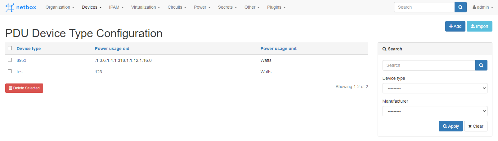
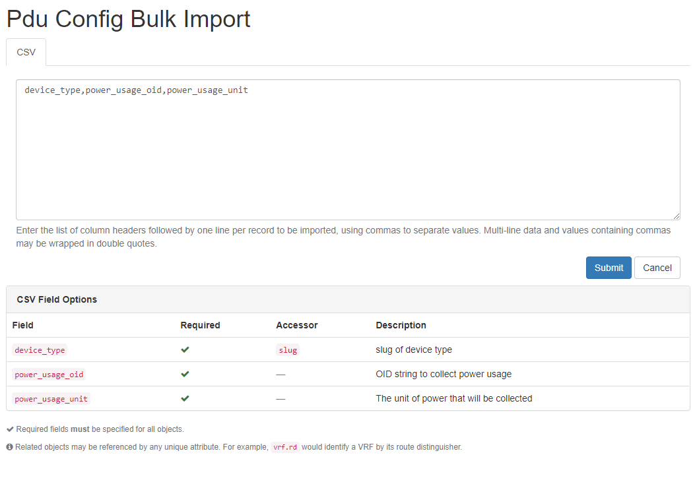
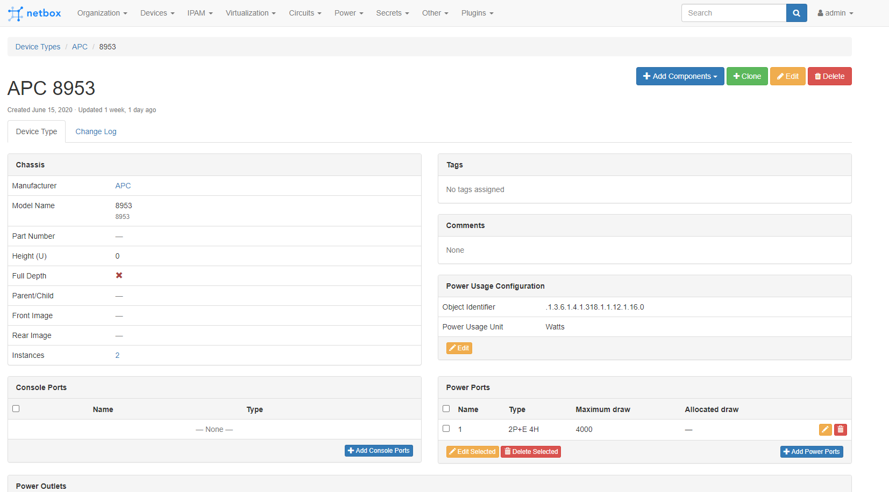
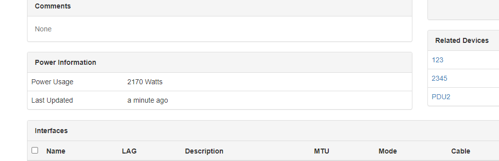
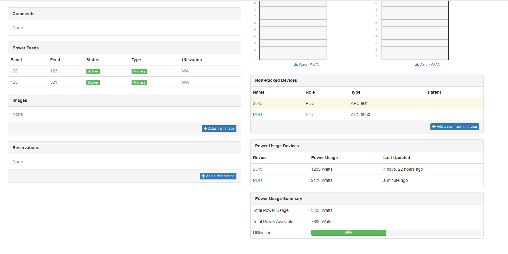

# Netbox PDU Plugin

A plugin for [Netbox](https://github.com/netbox-community/netbox) to get power distribution unit Information.

`axians-netbox-plugin-pdu` is using [Easy SNMP](https://easysnmp.readthedocs.io/en/latest/), [Django-RQ](https://github.com/rq/django-rq) and [RQ-Scheduler](https://github.com/rq/rq-scheduler) to display PDU information within Netbox.

## Installation
The plugin is available as a Python package in pypi and can be installed with pip

```
pip install axians-netbox-plugin-pdu
```

> The plugin is compatible with NetBox 2.9.1 and higher

Once installed, the plugin needs to be enabled in your `configuration.py`

```python
PLUGINS = ["axians_netbox_pdu"]

# PLUGINS_CONFIG = {
#   "axians_netbox_pdu": {
#     ADD YOUR SETTINGS HERE
#   }
# }
```

There are a number of default settings that can be altered using the following list of settings:

* `schedule`: Boolean (default True). If True, this will enable automatic polling of your PDU Devices.
* `schedule_interval`: Integer (default 300 seconds). Length of time between each scheduled poll.
* `snmp_read`: String (default public) SNMP read value for your SNMP enabled PDU's.
* `snmp_write`: String (default private) SNMP write value for your SNMP enabled PDU's.
* `rack_view_pdu_devices`: Boolean (default True), if True, the power usage per PDU will be displayed on the rack page.
* `rack_view_usage_summary`: Boolean (default True), if True, the a summary information tile will appear within the rack page to show true power utilization within the rack.
* `rack_view_summary_unit`: String (default watts), option to display watts/kilowatts on the rack summary view. If "kilowatts" is used the power usage summary will display in Kilowatts.

## Usage
### Preparation
For this plugin to work there must be a new worker added to your Netbox installation. The new worker is a custom scheduler that will schedule the PDU Tasks to run on an interval and utilize the django-rq library.

> You can utilize this library without the automated tasks by feeding Netbox the power usage information via the `axians_netbox_pdu` API.

### Default Environment
For the standard install please use the included [netbox-pdu.service](contrib/netbox-pdu.service) and install using the standard [Netbox Documentation](https://netbox.readthedocs.io/en/stable/installation/migrating-to-systemd/).

### Docker Environment
To use within Docker make sure you have a container running that runs the following command: `python manage.py pduschedule`

### Adding a new PDU Configuration
Once installed and the `pduscheduler` is running you can attach a `PDUConfig` to a DeviceType. To do this you must have a DeviceType configured with PowerOutlets. You can specify the DeviceType, PDU SNMP OID and the Unit. This enables the plugin to know what SNMP OID to collect per DeviceType.

Now a PDUConfig has been created a device must be created with a management IP. Once this is done the plugin can poll the PDU via SNMP and save the power usage.

This can also be done via Bulk Import or via the API.

> If a a PDUConfig is not created for a DeviceType and the Device does not have a Primary IP no data will be collected.

### API
The plugin includes several endpoints to manage the PDUConfig and PDUStatus.

```
GET       /api/plugins/pdu/pdu-config/         List PDUConfig
POST      /api/plugins/pdu/pdu-config/         Create PDUConfig
PATCH/PUT /api/plugins/pdu/pdu-config/{id}/    Edit a specific PDUConfig
DELETE /api/plugins/pdu/pdu-config/{id}/       Delete a specific PDUConfig

GET       /api/plugins/pdu/pdu-status/         List PDUStatus
POST      /api/plugins/pdu/pdu-status/         Create PDUStatus
PATCH/PUT /api/plugins/pdu/pdu-status/{id}/    Edit a specific PDUStatus
DELETE /api/plugins/pdu/pdu-status/{id}/       Delete a specific PDUStatus
```

## Screen Shots
List of PDUConfig Instances


Import PDUConfig Instances


Edit PDUConfig Instances


View PDUStatus Device View


View PDUStatus Rack View


## Contributing

Pull requests are welcomed.

The project is packaged with a light development environment based on `docker-compose` to help with the local development of the project.

- Black, Pylint, Bandit and pydockstyle for Python linting and formatting.
- Django unit test to ensure the plugin is working properly.

### CLI Helper Commands

The project comes with a CLI helper based on [invoke](http://www.pyinvoke.org/) to help setup the development environment. The commands are listed below in 3 categories `dev environment`, `utility` and `testing`.

Each command can be executed with `invoke <command>`. All commands support the arguments `--netbox-ver` and `--python-ver` if you want to manually define the version of Python and Netbox to use. Each command also has its own help `invoke <command> --help`.

#### Local dev environment
```
  build            Build all docker images.
  debug            Start NetBox and its dependencies in debug mode.
  destroy          Destroy all containers and volumes.
  start            Start NetBox and its dependencies in detached mode.
  stop             Stop NetBox and its dependencies.
```


#### Utility
```
  cli              Launch a bash shell inside the running NetBox container.
  create-user      Create a new user in django (default: admin), will prompt for password.
  makemigrations   Run Make Migration in Django.
  nbshell          Launch a nbshell session.
```
#### Testing

```
  tests            Run all tests for this plugin.
  pylint           Run pylint code analysis.
  pydocstyle       Run pydocstyle to validate docstring formatting adheres to NTC defined standards.
  bandit           Run bandit to validate basic static code security analysis.
  black            Run black to check that Python files adhere to its style standards.
  unittest         Run Django unit tests for the plugin.
```